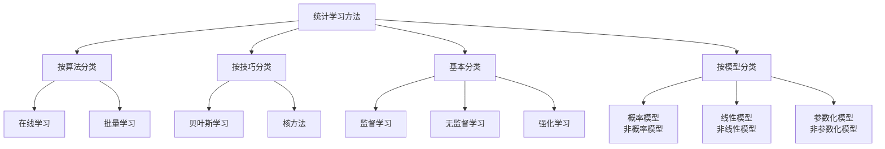
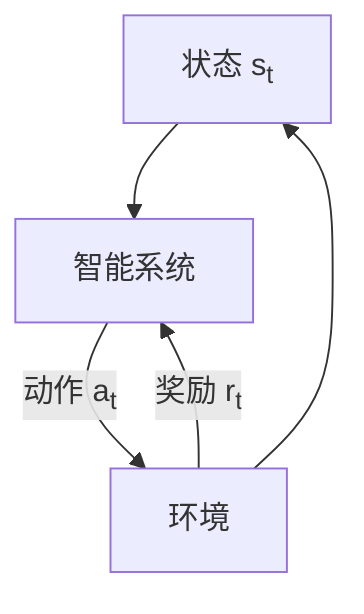

# 统计学习方法

## 初识统计学习

### 统计学习的定义概念

**统计学习是关于计算机基于数据构建概率统计模型并运用模型对数据进行预测和分析的一门学科**

- 以计算机和网络为平台
- 以数据为研究对象
- 以预测和分析数据为目的
- 以方法为中心
- 是多领域交叉的新学科

### 统计学习方法的具体步骤

1. 得到一个有限的训练数据集合
2. 确定学习模型的集合
3. 确定模型选择的准则
4. 实现求解最优模型的算法
5. 通过学习方法选择最优模型
6. 利用学习的最优模型对新数据进行预测和分析

### 统计学习方法分类

## 统计学习方法的基本分类

| 学习方法   | 数据类型                           | 预测模型                   | 本质                           |
| ---------- | ---------------------------------- | -------------------------- | ------------------------------ |
| 监督学习   | 标注数据：表示输入和输出的对应关系 | 对给定的输入产生相应的输出 | 学习输入到输出的统计规律       |
| 无监督学习 | 无标注数据：自然得到的数据         | 表示数据的类别，转换或概率 | 学习数据中的统计规律或潜在结构 |

### 监督学习

定义：从标注数据中学习预测模型的机器学习问题，其本质是学习输入到输出的映射的统计规律

基本假设：X和Y具有联合概率分布$P（X,Y）$

目的：学习一个输入到输出的映射并以模型表示

**对具体的输入进行相应的输出与测试，表达为：P(Y|X) 或者y = f(x)**

相关概念：

- 输入空间：输入的所有可能取值的集合
- 输出空间：输出的所有可能取值的集合
- 实例：每一个具体的输入，通常由特征向量表示
- 特征空间：所有特征向量存在的空间
- 假设空间：所有可能的模型的集合

问题：

- 回归问题：输入变量与输出变量均为连续变量的预测问题
- 分类问题：输出变量为有限个离散变量的预测问题
- 标注问题：输入变量与输出变脸均为变量序列的预测问题

符号表示

- 输入变量：X；输入变量的取值：x；
- 输出变量：Y；输出变量的取值：y；
- 样本为$N$的训练集：$T = \{X_1,X_2,...,X_N\}$

### 无监督学习

定义：从无标注数据中学习预测模型的机器学习问题，其本质是学习数据中的统计规律或潜在结构

目的：选出在给定评价下的最优模型

相关概念：

- 输入空间：X
- 隐式结构空间：Z
- 模型：函数$z = g(x)$
- 假设空间：同上
- 样本为$U$的训练集：$U = \{X_1,X_2,...,X_N\}$

### 强化学习

定义：让智能体在与环境的持续互动中通过试错学习，依据环境反馈的奖励调整行为策略，以实现长期累积奖励最大化的机器学习范式。

## 统计学习方法的三要素

**模型+策略+算法**

### 监督学习

#### 模型

定义：

假设空间：所有可能的条件概率分布或决策函数，用$\mathcal{F}$表示

- 若定义为决策函数的集合：$\mathcal{F} = \{f|Y=f(x)\}$，

  $\mathcal{F}$由一个参数向量决定的函数族构成：$\mathcal{F} = \{f|Y =f_\theta(X),\theta \in R^n\}$

- 若定义为条件概率的集合：$\mathcal{F}=\{P|P(Y|X)\}$

  $\mathcal{F}$由一个参数向量决定的条件概率分布族构成$\mathcal{F} = \{P|P_\theta(Y|X),\theta \in R^n\}$

#### 策略

概念：

- 损失函数：度量模型一次预测的好坏，记作$L(Y,f(x))$
- 期望风险：度量平均意义下模型的好坏

$$
\begin{aligned} R_{\text{exp}}(f) &= E_P[L(Y, f(X))] \\ &= \int_{\mathcal{X} \times \mathcal{Y}} L(y, f(x)) P(x, y) dxdy \end{aligned}
$$

- 经验风险：模型$f(X)$关于训练集的平均损失

$$
R_{emp}(f) = \frac{1}{N} \sum^N_{i=1}L(y_i,f(x_i))
$$

- 结构风险（在经验风险上加了一个惩罚项）：

$$
R_{srm}= \frac{1}{N} \sum^N_{i=1}L(y_i,f(x_i))+\lambda J(f) = R_{emp}(f)+\lambda J(f)
$$

当$N \rightarrow \infty$经验风险和结构风险相等

常见的损失函数

- 0-1 Loss Function

$$
L(Y,f(x))=\begin{cases}
1, & \text Y \neq f(X)\\
0, & \text Y = f(X)
\end{cases}
$$

- Quadratic Loss Function

$$
L(Y,f(X)) = (Y-f(X)^2)
$$

- Absolute Loss Function

$$
L(Y,f(X)) = |Y-f(X)|
$$

- Logarithmic Loss Function

$$
L(Y,P(Y|X)) = -logP(Y|X)
$$

原则：

- 经验风险最小化：

$$
min_{\mathcal{f} \in \mathcal{F}} \frac{1}{N} \sum_{i=1}^N L(y_i,f(x_i))
$$

- 结构风险最小化：

$$
min_{\mathcal{f} \in \mathcal{F}} \frac{1}{N} \sum^N_{i=1}L(y_i,f(x_i))+\lambda J(f)
$$

#### 算法

定义：用于求解最优模型的问题，若优化问题存在显示解析解，算法简易，通常不存在解析解，需要数值级算方法，比如梯度下降法

### 无监督学习

- 模型：函数$z = g_0(x)$，条件概率分布$P_\theta(z|x)$或条件概率分布$P_\theta(x|z)$
- 策略：优化目标函数
- 算法：通常是迭代算法

## 模型的评估与选择

### 训练误差与测试误差

训练误差：

1. 假设学习到的模型：$$Y = \hat{f}(X)$$
2. 训练集为$$T = \{(x_1, y_1), (x_2, y_2), \cdots, (x_N, y_N)\}$$
3. 训练误差：$$R_{emp}(\hat{f}) = \frac{1}{N} \sum_{i=1}^{N} L(y_i, \hat{f}^\mathrm{T}(x_i))$$

测试误差：

1. 学习到的模型：$$Y = \hat{f}(X)$$
2. 测试集：$$T' = \{(x_{1'}, y_{1'}), (x_{2'}, y_{2'}), \cdots, (x_{N'}, y_{N'})\}$$
3. 测试误差：$$e_{\text{test}} = \frac{1}{N'} \sum_{i'=1}^{N'} L(y_{i'}, \hat{f}(x_{i'}))$$

误差率（Error Rate）：

$$e_{\text{test}} = \frac{1}{N'} \sum_{i'=1}^{N'} I(y_{i'} \neq \hat{f}(x_{i'}))$$

准确率（Accuracy）：

$$r_{\text{test}} = \frac{1}{N'} \sum_{i'=1}^{N'} I(y_{i'} = \hat{f}(x_{i'}))$$

注意，$r_{test}+e_{test} = 1$

### 过拟合与模型选择

定义：学习所得到的模型包含参数过多，出现对已知数据预测的很好，但对位置数据预测很差的现象

要选择训练误差与测试误差达到平衡的模型

## 正则化与交叉验证

### 正则化

> 奥卡姆剃刀原理：在模型选择中，选择所有可能模型中，能很好解释已知数据并且十分简单的模型

定义：实现结构风险最小化策略

- 一般形式：\(\min_{f \in \mathcal{F}} \frac{1}{N} \sum_{i=1}^{N} L(y_i, f(x_i)) + \lambda J(f)\)

- 经验风险：\(\frac{1}{N} \sum_{i=1}^{N} L(y_i, f(x_i))\)

- 正则化项：\(\lambda J(f)\)  

其中$\lambda$权衡风险和模型复杂度

正则化项的两种形式

1. $L_1$范数：特征筛选

$$
L(w) = \frac{1}{N} \sum_{i=1}^N (f(x_i;w)-y_i^2)+\lambda||w||1
$$

其中，$||w||_1 = \sum_j|w_j|$

2. $L_2$范数：防止过拟合

$$
L(w) = \frac{1}{N} \sum^N_{i=1}(f(x_i;w)-y_i)^2+ \frac{\lambda}{2}||w||^2
$$

其中，$||W||_2 = \sqrt{\sum_j w_j^2}$，$||w||^2_2 = \sum_jw_j^2$

### 交叉验证

数据集充足的情况下：

将数据集分类：

- 训练集：训练模型
- 验证集：选择模型
- 测试集：评估模型

数据不足的情况下：

- 简单交叉认证：随机将数据分为两部分，训练集和测试集
- S折交叉验证：将数据分为S个互不相交，大小相同的子集，S-1个子集作为训练集，余下的子集作为训练集
- 留一交叉验证：S折交叉验证的特殊情形，S=N

## 泛化能力

### 泛化误差

定义：模型$\hat{f}$对未知数据预测的误差
$$
\begin{aligned}
R_{\exp}(\hat{f}) &= E_{P}[L(Y, \hat{f}(X))] \\
&= \int_{\mathcal{X} \times \mathcal{Y}} L(y, \hat{f}(x)) P(x, y) dxdy
\end{aligned}
$$

### 泛化误差上界

定义：泛化误差的概率上界

性质：

- 当样本容量增加，泛化上界趋于零
- 空间容量越大，模型越难学，泛化误差上界越大

定理（二分类）：

对于二分类问题，当假设空间是有限个函数的集合 \(\mathcal{F} = \{f_1, f_2, \cdots, f_d\}\) 时，对 \(\forall f \in \mathcal{F}\)，至少以概率 \(1 - \delta\)，\(0 < \delta < 1\)，以下不等式成立：
$$
R(f) \leq \hat{R}(f) + \varepsilon(d, N, \delta)
$$
其中，
\(\varepsilon(d, N, \delta) = \sqrt{\frac{1}{2N}\left(\log d + \log \frac{1}{\delta}\right)}\)

**Hoeffding 不等式**(第一版)

设 \(X_1, X_2, \cdots, X_N\) 是独立随机变量，且 \(X_i \in [a_i, b_i]\)，\(i = 1, 2, \cdots, N\)；\(S_N = \sum_{i=1}^N X_i\)，则对任意 \(t > 0\)，以下不等式成立：
$$
P\left[S_N - E(S_N) \geq t\right] \leq \exp\left[-\frac{2t^2}{\sum_{i=1}^N (b_i - a_i)^2}\right]\\

P\left[E(S_N) - S_N \geq t\right] \leq \exp\left[-\frac{2t^2}{\sum_{i=1}^N (b_i - a_i)^2}\right]
$$
**Hoeffding 不等式（第二版）** 

设 \(X_1, X_2, \cdots, X_N\) 是独立随机变量，且 \(X_i \in [a_i, b_i]\)，\(i = 1, 2, \cdots, N\)；\(\bar{X}\) 是 \(X_1, X_2, \cdots, X_N\) 的经验均值，\(\bar{X} = \frac{1}{N} \sum_{i=1}^N X_i\)，则对任意 \(t > 0\)，以下不等式成立：
$$
P\left[\bar{X} - E(\bar{X}) \geq t\right] \leq \exp\left[-\frac{2N^2 t^2}{\sum_{i=1}^N (b_i - a_i)^2}\right]\\

P\left[E(\bar{X}) - \bar{X} \geq t\right] \leq \exp\left[-\frac{2N^2 t^2}{\sum_{i=1}^N (b_i - a_i)^2}\right]
$$

## 生成模型与判别模型

### 生成模型

定义：由数据学习联合分布概率$P(X|Y)$，然后求出$P(X|Y)$作为预测模型
$$
P(Y|X) = \frac{P(X,Y)}{P(X)}
$$
常见模型：朴素贝叶斯法、隐马尔可夫模型

### 判别模型

定义：由数据直接学习得到决策函数$f(X)$或者条件概率分布$P(Y|X)$作为预测模型

常见模型：k近邻法、感知机、决策树

### 两种模型的差异

| 模型     | 数据量             | 预测相关                   | 收敛速度 | 学习问题简化 | 数据特性反映           | 隐变量存在时 |
| -------- | ------------------ | -------------------------- | -------- | ------------ | ---------------------- | ------------ |
| 生成模型 | 较大               | 可还原联合概率分布         | 快       |              | 能反映同类数据的相似度 | 仍可使用     |
| 判别模型 | （相对生成模型）少 | 可直接面对预测，准确率更高 |          | 可简化       | 不能反映数据本身特性   |              |

## 监督学习应用

### 分类问题

分类准确率：分类正确的样本数与总样本数之比
$$
r_{rest} = \frac{1}{N} \sum^{N'}_{i'=1} I{y_{i'}= \hat{f}(x_{i'}))}
$$
混淆矩阵：

| 预测\真实 | 正类 | 负类 |
| --------- | ---- | ---- |
| 正类      | TP   | FP   |
| 负类      | FN   | TN   |

评价指标：

- 精确率：

$$
P=\frac{TP}{TP+FP}
$$

- 召回率：

$$
R = \frac{TP}{TP+FN}
$$

- 调和值：

$$
\frac{2}{F_1}=\frac{1}{P}+\frac{1}{R}
$$

方法：

- 感知机
- k近邻法
- 朴素贝叶斯
- 决策树
- Logistic回归

### 标注问题

1. 训练集

- 整体表示：\(\mathcal{T} = \{(x_1, y_1), (x_2, y_2), \cdots, (x_N, y_N)\}\)，包含 N 组输入 - 输出对。
- 输入观测序列：对于第 i 个样本，\(x_i = (x_i^{(1)}, x_i^{(2)}, \cdots, x_i^{(n)})^T\)（\(i = 1,2,\cdots,N\)），是 n 维列向量，代表样本的多维度特征。
- 输出标记序列：对于第 i 个样本，\(y_i = (y_i^{(1)}, y_i^{(2)}, \cdots, y_i^{(n)})^T\)（\(i = 1,2,\cdots,N\)），是 n 维列向量，代表样本对应的多维度标记（标签）。

2. 学习的模型

目标是学习条件概率 \(P(Y^{(1)}, Y^{(2)}, \cdots, Y^{(n)} | X^{(1)}, X^{(2)}, \cdots, X^{(n)})\)，即给定输入特征序列 \(X^{(1)}, X^{(2)}, \cdots, X^{(n)}\) 时，输出标记序列 \(Y^{(1)}, Y^{(2)}, \cdots, Y^{(n)}\) 的联合概率分布，用于后续根据输入预测输出。

3. 预测

- 新的输入观测序列：\(x_{N + 1} = (x_{N + 1}^{(1)}, x_{N + 1}^{(2)}, \cdots, x_{N + 1}^{(n)})^T\)，是待预测样本的输入特征。
- 预测的输出标记序列：\(y_{N + 1} = (y_{N + 1}^{(1)}, y_{N + 1}^{(2)}, \cdots, y_{N + 1}^{(n)})^T\)，是模型根据新输入预测出的输出标记。

方法：

- 隐马尔可夫链
- 条件随机场

### 回归问题

类型：

- 按变量个数：一元回归，多元回归
- 按输入和输出变量之间的关系：线性回归，非线性回归

损失函数：平方损失

应用：商务领域
